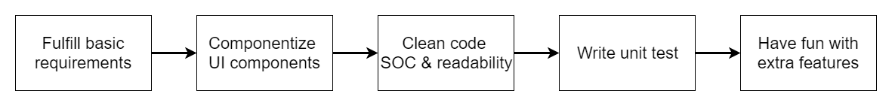

# Dev Notes

Author: Tsung Wei Huang (David Huang)  
Contact: bugman195.work@gmail.com  

## How to Start Test Server

```bash
cd 4f40ccab74df729b3bb627d69dd0b0d39e05e260/
yarn install
yarn serve
open http://localhost:9000/
```

## Routes

- Home page: `localhost:9000/`
- Product detail page: `localhost:9000/product/{id}`

## Used Stacks

- react
- redux
- axios
- react-router
- redux-thunk
- CSS module
- jest
- enzyme
- webpack
- babel

## Project Planning & Roadmap



## Requirements Checklist

1. (Done) The default view for the application is the Item List page.
2. (Done) When an Item on the Item List page is clicked, the application should navigate to the Item Detail page.
3. (Done) It should be possible to navigate directly to an Item Detail page by URL.
4. (Done) Implement the Item List page according to the specification.
5. (Done) Implement the Item Details page according to the specification.
6. (Done) Please use the provided [API](./API.md).
7. (Done) Please do not use any boilerplate such as `create-react-app`.
8. (Done) Please use English for communication, commit messages and comments.

## Extra Features

1. Product category filter  


2. Unit test for main components

```bash
yarn test
```

See test plan [here](##Test%20Plan).

## Component Tree Design

### Home Page


### Product Detail Page


## Test Plan

### React Components

App:

- Should render **Home Page** as default route
- Should render **Home Page** when URL path is not defined
- Should render **Detail Page** for URL: `/detail/{id}` when id exists in DB
- Should render **Not Found Page** for URL: `/detail/{id}` when id does NOT exist in DB

Home Page:

- Should render main navbar
- Should render categories filter bar
- Should render product box list

Detail Page:

- Should render detail nav
- Should render like button
- Should render: img/title/description
- Should render fixed footer

Category Filter Bar:

- Should render multiple categories with 'categories' prop

Product Box List:

- Should render multiple product box with 'items' prop

Product Box:

- Should redirect to detail page on click
- Should contain item img/name/price/likes
- Should be able to show 'SOLD' status

Fixed Footer:

- Should render: price/shipping fee
